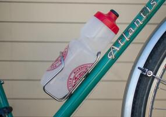
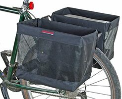
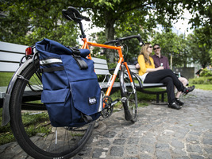
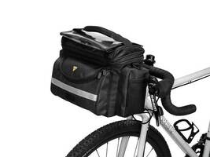

## Am I able to ride 30 miles?

Probably! If you're even moderately fit (and as long as your bike is
in good condition and of an appropriate size), 15 miles isn't going to be
much of a challenge, especially on a rail trail (which, because it
runs along an old railroad bed, is very, very flat). Your legs might
feel a bit tired on the way back, but you'll make it!

## What you'll need to bring on the ride

For our longer ride, you will want to bring the following (which will
hopefully sound a lot like the things you would typically bring on a
hike):

- Water
- A snack (no nuts!)
- A lunch
- A route map

The snack will be important if you feel your energy flagging before or
after lunch.

You will also want a place to stow some warm clothing. You may want to
wear a sweater or something when we start up, but depending on the
weather and our level of exertion you may want to take it off during
the ride. If the weather is cool, you will definitely want something
warm when we stop for a break or for lunch to prevent yourself from
cooling off too quickly. As with hiking, dressing in layers is a good
idea, because that gives you some flexibility in responding to changes
in temperature and activity.

## Navigating

Bicycle tours would traditionally provided you with a "cue sheet",
which is a table of directions, like these directions to get from the
United Methodist Church to Belmont High School:

| # | Go | onto Road/Street | Miles | Total |
|---|----|------------------|-------|-------|
| 1 | L  | Common St        | 1     | 1     |
| 2 | R  | Concord Ave      | 0.5   | 1.5   |

Using a cue sheet requires you to have some way of measuring distance,
such as a [bicycle computer][], but these have largely been replaced
by modern smartphones and tools like Google Maps.

[bicycle computer]: https://www.amazon.com/XOSS-Computer-Speedometer-Waterproof-Bluetooth/dp/B083QLWSMF

You can see our route from Camp Greenough to Crosby Beach in [Google
Maps][], or as a [PDF file suitable for printing][pdfmap].

[google maps]: https://goo.gl/maps/WLnNkScjStC77oTU6
[pdfmap]: maps/alltrails-map.pdf

There is also a [cue sheet][] generated from Google Maps.

[cue sheet]: maps/google-maps-cue-sheet.pdf

## Rules of the road

While our ride is mostly on the rail trail, there will be parts of it
on the main roads. Whether on or off the trail, when cycling as a
group we should follow these rules:

- Wear a helmet
- Bicycle single file
- Always [signal our turns][]

[signal our turns]: https://www.scouterlife.com/blog/2018/6/5/bicycle-hand-signals

---

## Carrying things on your bike

You can obviously just toss everything in a backpack and be done with
it, but there are some disadvantages to a backpack:

- You probably won't be able to reach your water while you're cycling.
  You will need to stop, remove your backpack, take a drink, and then
  put everything back.

- A backpack will often leave you with a sweaty back, which can be
  very uncomfortable in cooler weather (especially when you stop for a
  break).

- The weight of backpack can be uncomfortable over time.

Generally, it's better to let your bike carry things for you if you
have that option.

For water in particular, bottle cages mounted to the frame of your
bicycle are convenient because they allow you to retrieve a water
bottle while cycling. While many cages are designed to attach to
special mounting holes on your bicycle, you can also find ones that
simply clip on to your bike.

For everything else, the best option is probably a [bike rack][] and
[panniers][]. This keeps the weight on your bike and off your back,
and gives you a lower center of gravity which makes it easier to
control your bicycle. Bike racks and panniers are available from your
local bike shop (who will happily install them for you) and online (if
you're comfortable doing it yourself). You can even [make your own
panniers][] if you are so inclined.

[make your own panniers]: https://www.rei.com/blog/cycle/diy-make-your-own-bucket-bike-panniers

[Grocery bag panniers][] are inexpensive, easy to use and are designed
to hold a typical shopping bag, which makes them great for trips to
the grocery store. Typically they are open on top, which makes them
less effective in inclement weather (and means that things can bounce
out if they are light enough).

There a variety of other styles of pannier: totally waterproof ones
for protecting you gear in rainy weather; panniers designed
specifically for commuting to work and school that will carry a laptop
and other gear; panniers designed for long-distance bicycle touring,
etc. As with any sort of bag, prices for panniers very greatly, and
you will probably able to find something to match your budget with
a little bit of research.

For just carrying lunch and snack, another option is a [handlebar
bag][]. These are generally cheaper than panniers, but they are
limited in how much weight they can carry: you don't want to put too
much weight on your handlebars because it can significantly impact the
handling of your bicycle.

[bike rack]: https://www.amazon.com/dp/B000FIE3WI/ref=cm_sw_em_r_mt_dp_7N93RSKDE8DETDJDJ217?_encoding=UTF8&psc=1
[grocery bag panniers]: https://banjobrothers.com/products/grocery-pannier-folding
[panniers]: https://en.wikipedia.org/wiki/Pannier
